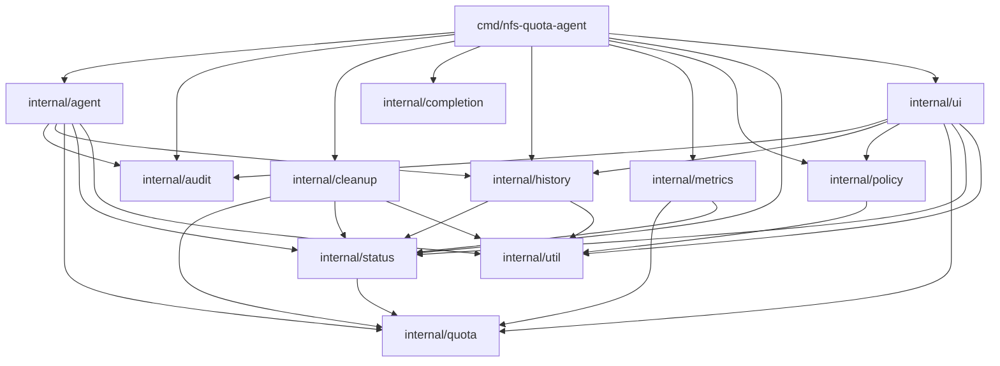
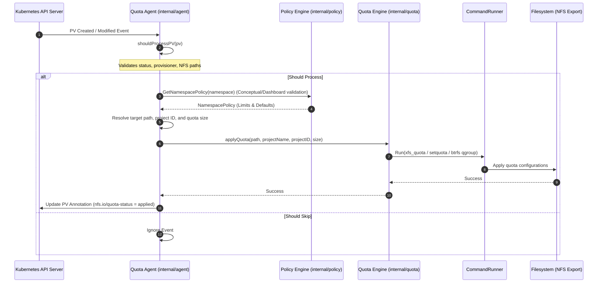

# NFS Quota Agent Architecture

This document provides a detailed architectural overview of the **nfs-quota-agent** system. The agent acts as a daemon running in a Kubernetes cluster to manage filesystem quotas on NFS exports based on Kubernetes PersistentVolumes (PVs).

For dynamic configuration and details on custom resources, please refer to the [Feature Guide](feature-guide.md).

## Core Architecture & Execution Flow

The NFS Quota Agent coordinates several sub-systems to monitor volumes, resolve quotas against policies, apply changes to the underlying storage filesystems, and report status.

### Key Sub-systems & Entry Points

1. **PersistentVolume Watch (`internal/agent`)**: Monitors the Kubernetes API Server for PV events. Upon identifying matching NFS volumes, it initiates the reconciliation loop.
2. **Policy Resolution (`internal/policy`)**: Inspects namespace-level restrictions using `LimitRanges`, `ResourceQuotas`, or custom annotations (`nfs.io/default-quota`, `nfs.io/max-quota`) to ensure requests remain within valid boundaries.
3. **Quota Application (`internal/quota`)**: Interacts directly with the filesystem quota subsystems via `CommandRunner` wrappers. It supports:
   - **XFS**: Employs `xfs_quota` for project-based quota boundaries.
   - **ext4**: Configures directory quotas via `setquota`.
   - **Btrfs**: Manages `qgroup` limits.
4. **Annotation Updates**: Marks successful reconciliations by adding annotations like `nfs.io/quota-status=applied` or `failed` back onto the PV resource.
5. **Periodic Sync**: Resolves drift by auditing all existing PVs and local filesystems periodically.
6. **Orphan Cleanup (`internal/cleanup`)**: Detects quota entries whose directories no longer have a corresponding active PV in Kubernetes, and removes the orphaned quotas (not the directories themselves) in dry-run, interactive, or forced mode.
7. **History Collection (`internal/history`)**: Takes snapshots of directories over time to capture storage trends.
8. **Metrics Exporter (`internal/metrics`)**: Serves Prometheus metrics on quota usage, disk consumption, and policy violations.
9. **Web UI (`internal/ui`)**: Serves an HTML5 dashboard for visual administration, log checking, and history viewing.

---

## PV Creation to Quota Application Flow

When a new PersistentVolume is provisioned, the following sequence of operations occurs:

### Sequence Step Details

- **Step 2 (`shouldProcessPV`)**: Filters events down to `VolumeBound` PersistentVolumes that match either native NFS specifications or the configured CSI driver provisioner (e.g. `nfs.csi.k8s.io`).
- **Step 4 (`GetNamespacePolicy`)**: Loads quota ceilings or defaults defined in the namespace. In the current implementation, policy validations are primarily displayed on the Web UI, queried through API endpoints, and used to report active policy violations.
- **Step 7 (`applyQuota`)**: Translates local NFS paths into mount directories, allocates unique project IDs (hashing project name with collision resolution), updates `/etc/projects` and `/etc/projid` configuration files, and configures the host filesystem limits.
- **Step 9 (`updateQuotaStatus`)**: Updates the `nfs.io/quota-status` annotation on the Kubernetes PV to inform cluster administrators and users that quotas are actively enforced.
