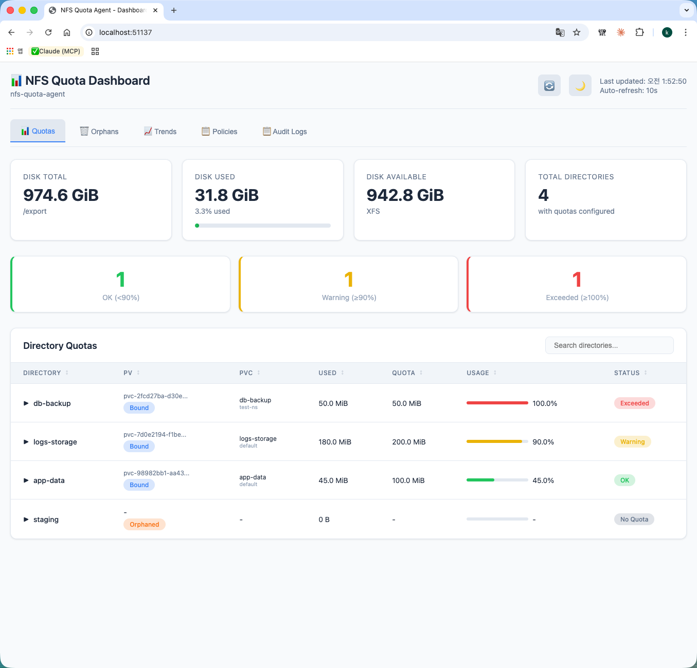
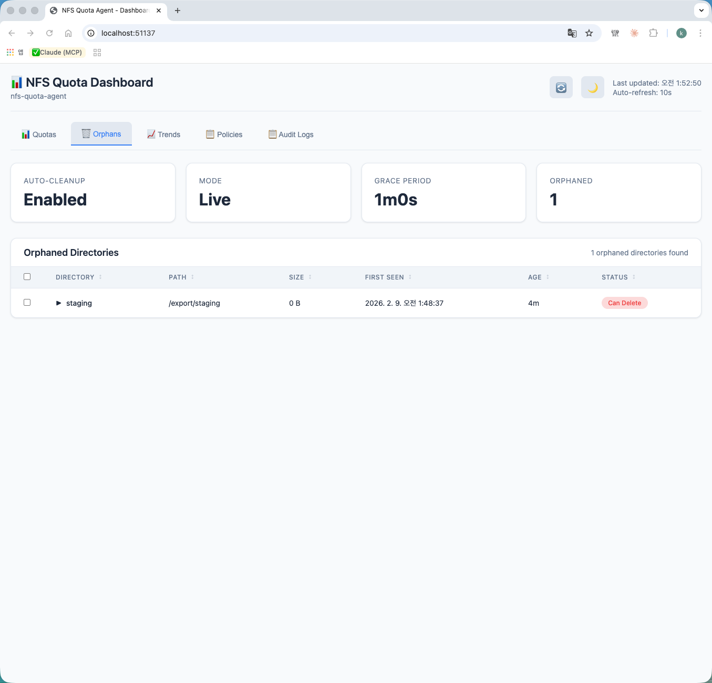
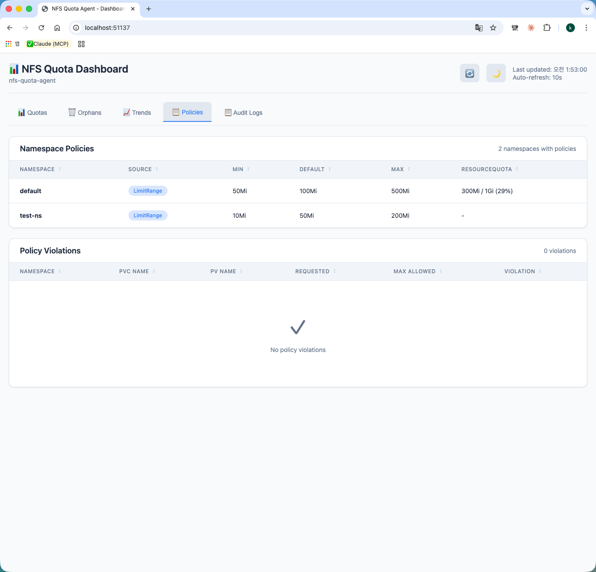
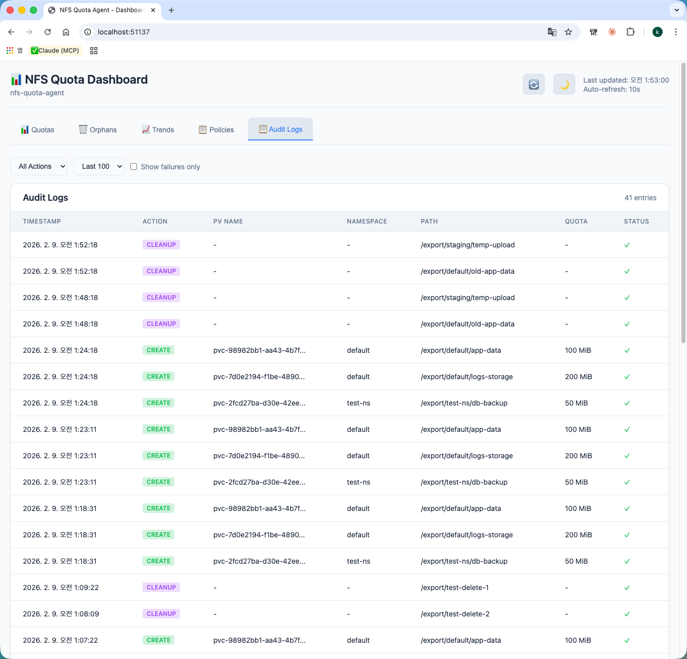

# NFS Quota Agent - Feature Guide

NFS Quota Agent provides a comprehensive web dashboard for monitoring and managing NFS storage quotas in Kubernetes environments. This guide walks through each feature with real-world examples.

## Prerequisites

- Kubernetes cluster with NFS CSI driver
- NFS Quota Agent deployed via Helm chart
- All features enabled (`--enable-ui`, `--enable-audit`, `--enable-auto-cleanup`, `--enable-history`, `--enable-policy`)

---

## 1. Dashboard & Quotas Tab



The **Quotas** tab is the default view showing a real-time overview of NFS storage.

### Summary Cards

| Card | Description | Example |
|------|-------------|---------|
| **DISK TOTAL** | Total NFS export disk capacity | 974.6 GiB (/export) |
| **DISK USED** | Current disk usage with percentage bar | 31.8 GiB (3.3%) |
| **DISK AVAILABLE** | Remaining free space and filesystem type | 942.8 GiB, XFS |
| **TOTAL DIRECTORIES** | Number of quota-managed directories | 4 with quotas configured |

### Status Indicators

| Status | Condition | Color |
|--------|-----------|-------|
| **OK** | Usage < 90% of quota | Green |
| **Warning** | Usage >= 90% of quota | Yellow |
| **Exceeded** | Usage >= 100% of quota | Red |

### Directory Quotas Table

Each row shows:
- **Directory**: Name with expandable file browser
- **PV**: PersistentVolume name and binding status (Bound badge)
- **PVC**: PersistentVolumeClaim name and namespace
- **Used / Quota**: Current usage vs configured limit
- **Usage**: Visual progress bar with percentage
- **Status**: Color-coded badge (OK / Warning / Exceeded / No Quota / Orphaned)

Directories are sorted by usage percentage (highest first) by default. Click any column header to change sort order.

### Key Observations

- **db-backup**: 50.0 MiB / 50.0 MiB (100%) — **Exceeded** status, full red bar
- **logs-storage**: 180.0 MiB / 200.0 MiB (90%) — **Warning** status, yellow bar
- **app-data**: 45.0 MiB / 100.0 MiB (45%) — **OK** status, green bar
- **staging**: Orphaned directory with no PV binding — **No Quota** status

---

## 2. Orphans Tab



The **Orphans** tab manages directories that exist on the NFS server but have no matching PersistentVolume in the cluster.

### Configuration Cards

| Card | Description |
|------|-------------|
| **AUTO-CLEANUP** | Whether automatic cleanup is enabled |
| **MODE** | Dry-Run (safe preview) or Live (actual deletion) |
| **GRACE PERIOD** | Time to wait before allowing deletion |
| **ORPHANED** | Count of detected orphan directories |

### Orphaned Directories Table

| Column | Description |
|--------|-------------|
| Checkbox | Select for bulk deletion (Live mode only) |
| Directory | Expandable directory name |
| Path | Full filesystem path |
| Size | Directory size |
| First Seen | When the orphan was first detected |
| Age | Time since detection |
| Status | "Can Delete" (past grace period) or "In Grace Period" |

### Cleanup Workflow

1. Agent detects directories without matching PVs
2. Directories enter grace period (configurable, default: 24h)
3. After grace period, status changes to "Can Delete"
4. In **Live mode**: select and delete via UI
5. In **Dry-Run mode**: preview only, no deletion

---

## 3. Trends Tab


The **Trends** tab tracks storage usage over time for capacity planning.

### Summary Cards

| Card | Description | Example |
|------|-------------|---------|
| **HISTORY ENTRIES** | Total snapshots recorded | 100 |
| **TRACKED PATHS** | Number of monitored directories | 6 |
| **RETENTION** | How long history is kept | 720h (30 days) |

### Usage Trends Table

| Column | Description |
|--------|-------------|
| Directory | Directory name |
| Current | Current usage |
| Quota | Configured limit |
| 24H Change | Usage change in last 24 hours |
| 7D Change | Usage change in last 7 days |
| 30D Change | Usage change in last 30 days |
| Trend | Direction arrow: ↑ (increasing), → (stable), ↓ (decreasing) |

### Trend Analysis

- **logs-storage**: +180 MiB across all periods with ↑ trend — growing rapidly
- **db-backup**: +50 MiB with ↑ trend — consistent growth
- **app-data**: +45 MiB with ↑ trend — moderate growth
- **old-app-data / temp-upload**: No quota, → stable trend
- **staging**: Empty orphan directory, → stable

---

## 4. Policies Tab



The **Policies** tab displays namespace-level storage policies and violations.

### Namespace Policies

Policies are derived from three sources (priority order):
1. **LimitRange** — Kubernetes LimitRange for PersistentVolumeClaim
2. **Annotation** — Namespace annotations (`nfs.io/default-quota`, `nfs.io/max-quota`)
3. **Global** — Agent's `--default-quota` flag

| Column | Description |
|--------|-------------|
| Namespace | Kubernetes namespace |
| Source | Policy source (LimitRange badge) |
| Min | Minimum allowed PVC size |
| Default | Default PVC size if not specified |
| Max | Maximum allowed PVC size |
| ResourceQuota | Namespace storage quota usage (e.g., 300Mi / 1Gi = 29%) |

### Example Policies

- **default** namespace: LimitRange 50Mi-500Mi, default 100Mi, ResourceQuota 300Mi/1Gi (29% used)
- **test-ns** namespace: LimitRange 10Mi-200Mi, default 50Mi, no ResourceQuota

### Policy Violations

When a PVC request exceeds the namespace's max quota or falls below the minimum, violations are displayed in the lower table with:
- Namespace, PVC name, PV name
- Requested size vs Max allowed
- Violation type (exceeds_max / below_min)

### Setting Up Policies

```yaml
# LimitRange for PVC storage limits
apiVersion: v1
kind: LimitRange
metadata:
  name: storage-limits
  namespace: default
spec:
  limits:
  - type: PersistentVolumeClaim
    max:
      storage: 500Mi
    min:
      storage: 50Mi
    default:
      storage: 100Mi
---
# ResourceQuota for total namespace storage
apiVersion: v1
kind: ResourceQuota
metadata:
  name: storage-quota
  namespace: default
spec:
  hard:
    requests.storage: 1Gi
    persistentvolumeclaims: "10"
```

---

## 5. Audit Logs Tab



The **Audit Logs** tab records a complete history of all quota operations.

### Filters

| Filter | Options |
|--------|---------|
| **Action** | All Actions, CREATE, UPDATE, DELETE, CLEANUP |
| **Limit** | 50, 100, 500, 1000 entries |
| **Fails only** | Show only failed operations |

### Log Entry Columns

| Column | Description |
|--------|-------------|
| Timestamp | Operation time |
| Action | CREATE / UPDATE / DELETE / CLEANUP |
| PV Name | Associated PersistentVolume |
| Namespace | Kubernetes namespace |
| Path | Directory path on NFS |
| Quota | Applied quota size |
| Status | Success (green checkmark) or Fail (red X with error) |

### Audit Trail Benefits

- Track all quota CREATE/UPDATE/DELETE events
- Identify failed operations and troubleshoot issues
- Compliance and change management documentation
- Filter by action type to focus on specific operations

---

## Keyboard Shortcuts

| Key | Action |
|-----|--------|
| `R` | Refresh data |
| `1`-`5` | Switch tabs |
| `/` | Focus search |

---

## Dark Mode

Click the moon icon (top right) to toggle dark mode. Theme preference is saved to localStorage.

---

## API Reference

All dashboard data is available via REST API:

```bash
# Status summary
curl http://localhost:8080/api/status

# Quota list with PV/PVC info
curl http://localhost:8080/api/quotas

# Audit logs (with filters)
curl "http://localhost:8080/api/audit?limit=100&action=CREATE"

# Orphan directories
curl http://localhost:8080/api/orphans

# Usage trends
curl http://localhost:8080/api/trends

# Namespace policies
curl http://localhost:8080/api/policies

# Policy violations
curl http://localhost:8080/api/violations

# Directory file browser
curl "http://localhost:8080/api/files?path=/export/default/app-data"
```
