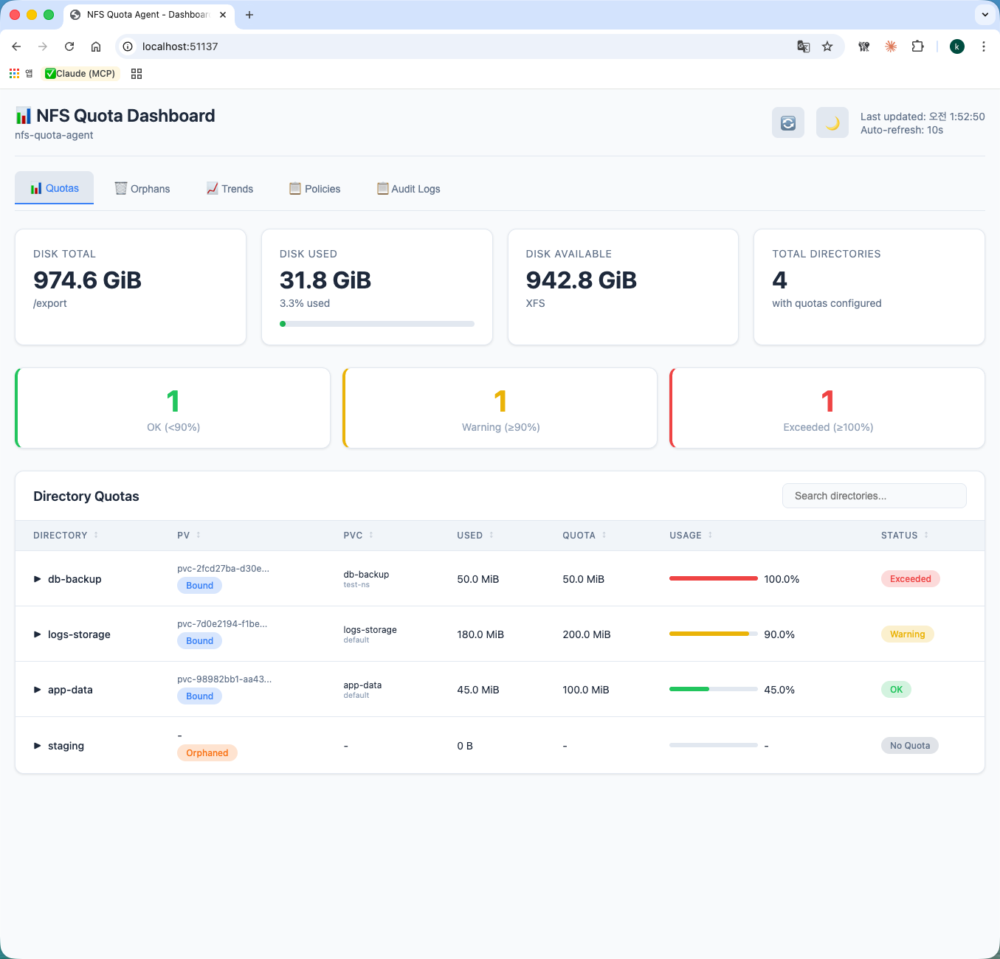
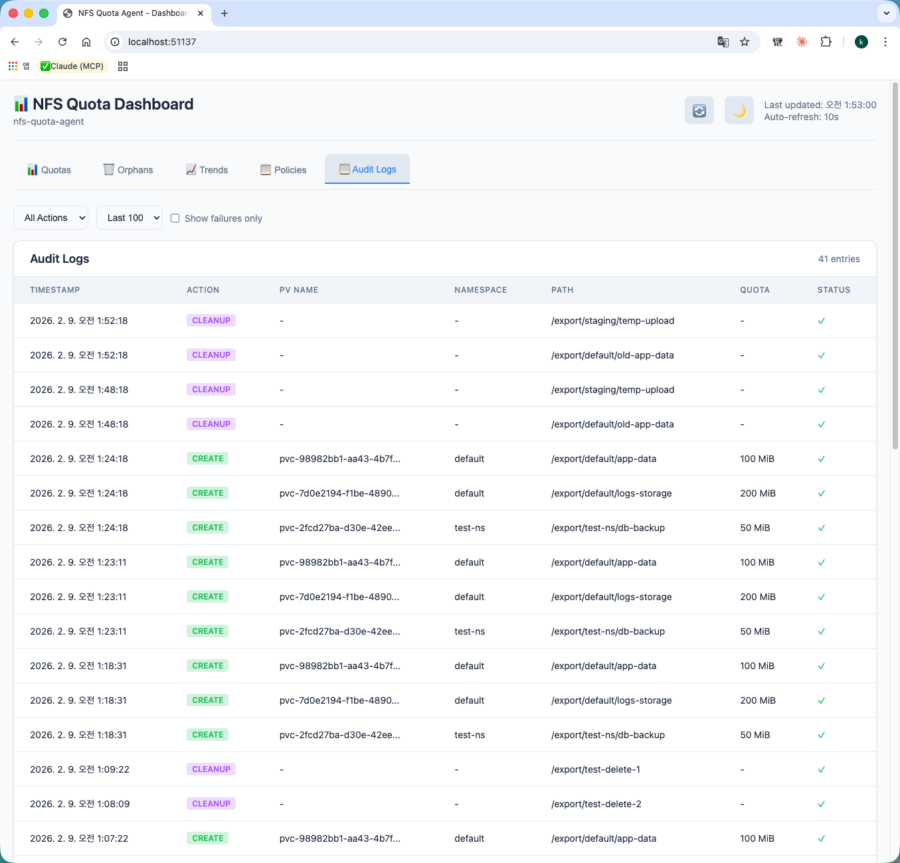
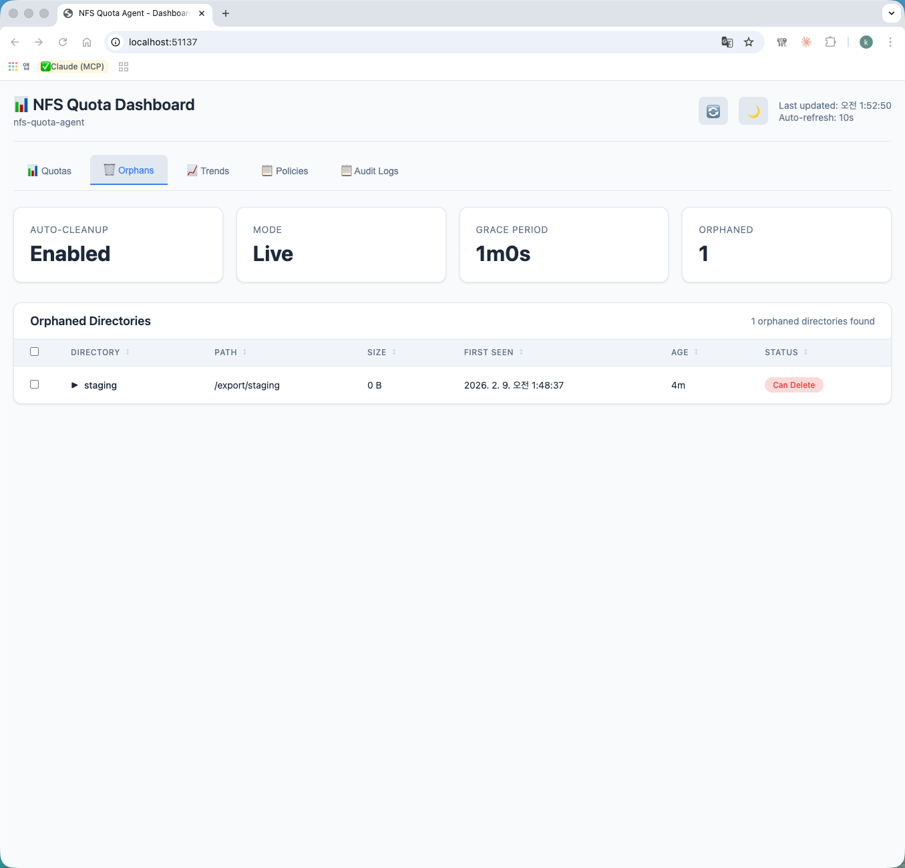
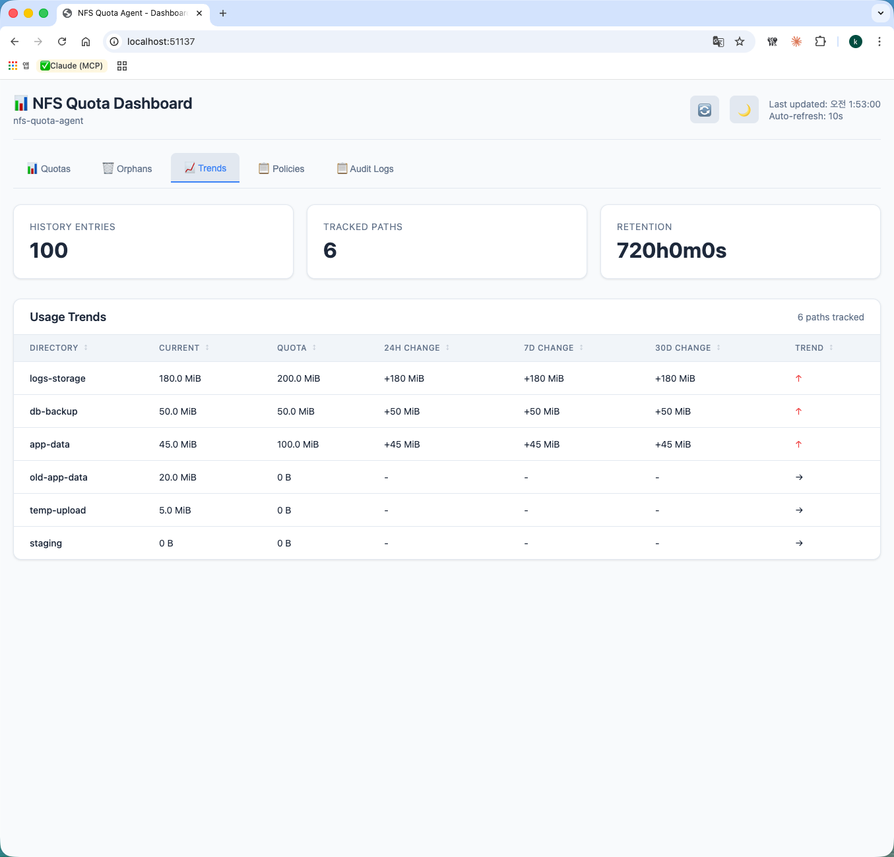
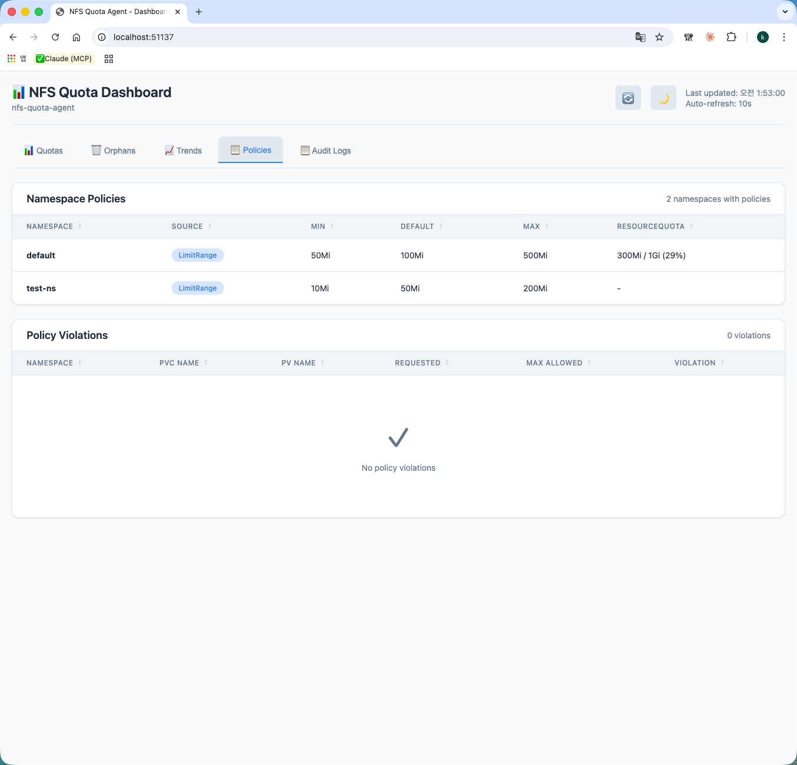

# Web UI Guide

NFS Quota Agent provides a web-based dashboard for monitoring and managing NFS quotas.

## Enabling Web UI

```bash
# CLI
nfs-quota-agent run --enable-ui --ui-addr=:8080

# Helm
helm install nfs-quota-agent ./charts/nfs-quota-agent \
  --set webUI.enabled=true \
  --set webUI.addr=":8080"
```

Access the UI at `http://<node-ip>:8080`

---

## Dashboard Overview



The dashboard displays real-time NFS quota status with the following summary cards:

| Card | Description |
|------|-------------|
| **Total Disk** | Total disk capacity of NFS export |
| **Used** | Current disk usage with percentage |
| **Available** | Free disk space |
| **Directories** | Number of quota-managed directories |
| **Warning** | Directories using 90-99% of quota |
| **Exceeded** | Directories exceeding quota limit |

### Namespace Summary
Below the summary cards, a **Usage by Namespace** panel displays aggregate storage consumption per Kubernetes namespace. The aggregate usage is represented as a visual progress bar indicating the total consumed quota within each namespace, allowing quick multi-tenant capacity checks.

### Common UI Features
- **Language Toggle**: Switch between English (`🇺🇸 EN`) and Korean (`🇰🇷 KO`) using the button in the header. The setting is saved in `localStorage`.
- **Auto-Refresh**: Configure automatic dashboard updates using the play/pause button and the interval select box (5s, 10s, 30s, or 60s). It only polls API endpoints related to the active tab to conserve network bandwidth.

---

## Tabs

### Quotas Tab

Main quota monitoring view showing all directories with quotas.

**Features:**
- **Sortable columns**: Click any header to sort. The sorting state is preserved during refresh.
- **Search**: Filter directories by name or path.
- **Expandable rows**: Click a row to view directory contents via the integrated File Browser.
- **Usage bar**: Visual representation of quota usage.
- **CSV Export**: Click the **📥 Export CSV** button to download a client-side generated CSV report of current quotas.
- **Status badges**: OK (green), Warning (yellow), Exceeded (red).

**Columns:**
| Column | Description |
|--------|-------------|
| Directory | Directory name (click to expand file list) |
| PV | PersistentVolume name and binding status |
| PVC | PersistentVolumeClaim name and namespace |
| Used | Current storage usage |
| Quota | Configured quota limit |
| Usage | Percentage bar with numeric value |
| Quota Status | The actual quota enforcement status: `Applied` (green), `Pending` (yellow), or `Failed` (red) |
| Status | OK / Warning / Exceeded / No Quota |

#### File Browser

Click any row to expand and view directory contents:
- 📁 Directories shown first
- 📄 Files with size information
- Sorted alphabetically

---

### Audit Tab



View quota operation history (requires `--enable-audit`).

**Features:**
- **CSV Export**: Click the **📥 Export CSV** button to export a CSV of the current audit trail.
- **Filters**: Filter entries by action (CREATE, UPDATE, DELETE, CLEANUP) and toggle to show failures only.

**Columns:**
| Column | Description |
|--------|-------------|
| Timestamp | Operation time |
| Action | CREATE / UPDATE / DELETE / CLEANUP |
| PV Name | Associated PersistentVolume |
| Namespace | Kubernetes namespace |
| Path | Directory path |
| Quota | Applied quota size |
| Status | Success (✓) or Fail (✗) with error |

---

### Orphans Tab



Manage orphaned directories (requires `--enable-auto-cleanup`).

**Info Cards:**
- Cleanup status (Enabled/Disabled)
- Mode (Dry-Run/Live)
- Grace Period
- Orphan Count

**Features:**
- **Scan Now**: Trigger an immediate orphan directory scan.
- **Clean Up**: Opens an inline confirmation panel that runs a dry-run check, displays the results, and requests final approval before triggering bulk cleanup.
- **Checkbox selection**: Select individual orphans for target removal.
- **Delete Selected**: Immediately delete selected orphans (Live mode only, with confirmation).
- **Btrfs notice**: When running on a Btrfs filesystem, project/projid-based orphan cleanup is disabled since Btrfs enforces quotas via qgroups.

**Columns:**
| Column | Description |
|--------|-------------|
| ☐ | Selection checkbox (Live mode only) |
| Name | Directory name |
| Path | Full path |
| Size | Directory size |
| First Seen | When orphan was detected |
| Age | Time since first detection |
| Status | Can Delete / In Grace Period |

#### Orphan Deletion

In **Live mode** (cleanup.dryRun=false):
1. Select orphans using checkboxes.
2. Click the **Delete Selected** button.
3. Confirm deletion in the inline approval panel.
4. Orphans are immediately removed.

---

### Trends Tab



View usage history and trends (requires `--enable-history`).

**SVG Line Chart:**
A dynamic SVG chart renders the usage history trends of tracked paths over time, complete with grid lines, time scales, and a color-coded legend.

**Info Cards:**
- History entries count
- Tracked paths count
- Retention period

**Columns:**
| Column | Description |
|--------|-------------|
| Directory | Directory name |
| Current | Current usage |
| Quota | Quota limit |
| 24h Change | Usage change in last 24 hours |
| 7d Change | Usage change in last 7 days |
| 30d Change | Usage change in last 30 days |
| Trend | ↑ (increasing) / ↓ (decreasing) / → (stable) |

---

### Policies Tab



View namespace quota policies (requires `--enable-policy`).

**Displays:**
- Namespace-level quota policies
- LimitRange configurations (displays object names underneath the LimitRange label)
- ResourceQuota usage (displays ResourceQuota object name and detailed limits)
- Policy violations (Exceeds Max / Below Min badges)

---

## API Endpoints

The Web UI uses the following REST APIs:

| Endpoint | Method | Description |
|----------|--------|-------------|
| `/api/status` | GET | Disk and quota summary |
| `/api/quotas` | GET | List all quotas |
| `/api/config` | GET | Feature flags |
| `/api/audit` | GET | Audit log entries |
| `/api/orphans` | GET | Orphan directories |
| `/api/orphans/scan` | POST | Scan for orphaned directories |
| `/api/orphans/cleanup`| POST | Perform orphaned cleanup |
| `/api/orphans/delete` | POST | Delete orphan |
| `/api/files` | GET | Directory contents |
| `/api/history` | GET | Usage history |
| `/api/trends` | GET | Usage trends |
| `/api/policies` | GET | Namespace policies |
| `/api/violations` | GET | Policy violations |

---

## Keyboard Shortcuts

| Key | Action |
|-----|--------|
| `R` | Refresh data |
| `1-5` | Switch tabs |
| `/` | Focus search |

*Note: Keyboard shortcuts are automatically disabled when typing in inputs, textareas, or select elements.*

---

## Troubleshooting

### Tab not visible

Tabs appear based on enabled features:

| Tab | Required Flag |
|-----|---------------|
| Audit | `--enable-audit` |
| Orphans | `--enable-auto-cleanup` |
| Trends | `--enable-history` |
| Policies | `--enable-policy` |

### Empty quota list

1. Check if NFS path is correctly mounted
2. Verify project quota is enabled on filesystem
3. Check agent logs: `kubectl logs -n nfs-quota-agent deploy/nfs-quota-agent`

### Delete button not showing

Orphan deletion requires:
- `--enable-auto-cleanup`
- `--cleanup-dry-run=false` (Live mode)
